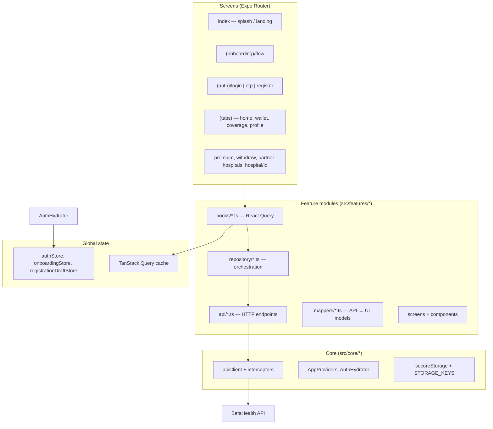
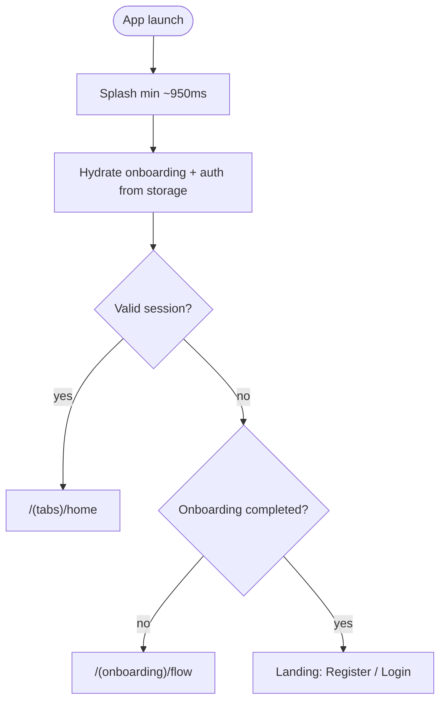
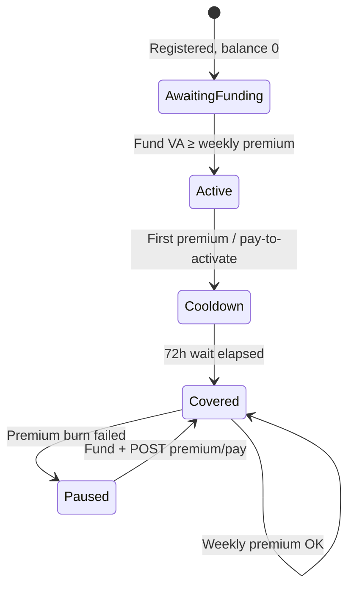

# BetaHealth Mobile App

React Native member app for **BetaHealth** (Squad-insureTech): weekly health savings, a Squad-funded wallet, and hospital cover up to a monthly limit for Nigeria’s informal sector. Members register, fund a virtual account, pay weekly premiums, visit partner clinics, and track claims, withdrawals, and notifications.

This app talks to the Node.js backend in [`../backend`](../backend). It never calls Squad APIs directly—wallet funding, premium burns, and payouts are server-side.

---

## Table of contents

- [Tech stack](#tech-stack)
- [Prerequisites](#prerequisites)
- [Getting started](#getting-started)
- [Environment](#environment)
- [Architecture](#architecture)
- [Navigation and user flows](#navigation-and-user-flows)
- [API integration](#api-integration)
- [Feature status](#feature-status)
- [Development](#development)
- [Related documentation](#related-documentation)

---

## Tech stack

| Layer | Tools |
|--------|--------|
| **Runtime** | [Expo SDK 54](https://docs.expo.dev/), React Native 0.81, React 19 |
| **Routing** | [Expo Router 6](https://docs.expo.dev/router/introduction/) (file-based, typed routes) |
| **Styling** | [NativeWind 4](https://www.nativewind.dev/) + Tailwind CSS 3 |
| **Server state** | [TanStack React Query 5](https://tanstack.com/query) |
| **Client state** | [Zustand 5](https://zustand.docs.pmnd.rs/) (auth, onboarding, registration draft, linked payout bank) |
| **HTTP** | [Axios](https://axios-http.com/) with JWT interceptors |
| **Forms / validation** | [react-hook-form](https://react-hook-form.com/), [Zod](https://zod.dev/) (env schema) |
| **Secure storage** | `expo-secure-store` (session token, drafts) |
| **Media** | `expo-camera` (registration face capture), `expo-av` + `expo-speech` (onboarding audio / TTS) |
| **UI icons** | [lucide-react-native](https://lucide.dev/) |
| **QR** | `react-native-qrcode-svg` (membership card) |
| **Tooling** | TypeScript 5.9, ESLint (expo config), Prettier, Husky + lint-staged |

The app enables React Native’s **new architecture** (`newArchEnabled` in `app.json`).

---

## Prerequisites

- **Node.js** 20+ (align with backend)
- **npm** (or compatible package manager)
- **Expo Go** or a dev build for iOS/Android
- **BetaHealth backend** running locally (default `http://localhost:4000/api/v1`)

---

## Getting started

```bash
cd mobile_app
npm install
cp .env.example .env.development   # or .env — see Environment
npm start                          # Expo dev server
```

Then press `a` (Android emulator), `i` (iOS simulator), or scan the QR code with Expo Go.

**Android emulator:** the host machine is `10.0.2.2`, not `localhost`:

```env
EXPO_PUBLIC_API_URL=http://10.0.2.2:4000/api/v1
```

**Physical device:** use your machine’s LAN IP, e.g. `http://192.168.1.42:4000/api/v1`.

Backend setup and demo seed: see [`../backend/readme.md`](../backend/readme.md) (`npm run dev`, `npm run seed:demo`).

---

## Environment

| Variable | Description |
|----------|-------------|
| `EXPO_PUBLIC_API_URL` | Base URL for all API calls (must include `/api/v1`). Validated in `src/config/env.ts`. |

Example (`.env.example`):

```env
EXPO_PUBLIC_API_URL=http://localhost:4000/api/v1
```

Expo only exposes variables prefixed with `EXPO_PUBLIC_` to the client bundle.

---

## Architecture

### High-level diagram



### Folder layout

```
mobile_app/
├── src/
│   ├── app/                 # Expo Router routes (thin re-exports)
│   ├── config/              # env (Zod)
│   ├── core/                # API client, providers, hooks, storage, theme
│   ├── features/            # Domain modules (see below)
│   ├── shared/              # Reusable UI, typography, formatters
│   ├── store/               # Cross-feature Zustand stores
│   └── types/               # backend.ts, api.ts — shared API shapes
├── assets/
├── app.json
├── babel.config.js          # @ alias, NativeWind, Reanimated
└── tailwind.config.js       # brand color tokens
```

### Feature module pattern

Each domain under `src/features/<name>/` typically follows:

| Layer | Responsibility |
|-------|----------------|
| `api/` | Raw HTTP calls via `apiClient` |
| `repository/` | Combines APIs, error handling, mapping entry points |
| `hooks/` | `useQuery` / `useMutation` wired to repositories |
| `mappers/` | Kobo → naira, cover status, premium billing state |
| `screens/`, `components/` | UI |
| `constants/`, `types/`, `utils/` | Domain helpers |

**Path alias:** `@/*` → `src/*` (TypeScript + Babel module-resolver).

### Cross-cutting concerns

- **Authentication:** JWT stored in Secure Store (`STORAGE_KEYS.authSession`). Request interceptor attaches `Authorization: Bearer <token>`. `401` clears session via `sessionBridge` → `AuthHydrator`.
- **Money:** Backend amounts are in **kobo**; UI uses `koboToNaira` / `nairaToKobo` in `src/core/api/kobo.ts`.
- **API envelope:** Responses use `{ success, data }` / `{ success: false, error }`; `unwrapResponse()` and `getApiErrorMessage()` normalize errors.
- **Authenticated queries:** `useAuthenticatedQueryEnabled()` gates React Query until auth is hydrated and a user exists.

---

## Navigation and user flows

### Route map

| Route | Screen / purpose |
|-------|------------------|
| `/` | Splash → session check → home, onboarding, or landing |
| `/(onboarding)/flow` | Product intro, language, welcome audio |
| `/(auth)/login` | Phone + password → request OTP |
| `/(auth)/otp` | Verify 6-digit OTP → JWT |
| `/(auth)/register` | Multi-step registration (face, BVN, wallet reveal) |
| `/(tabs)/home` | Dashboard (cover status, quick actions, recent activity) |
| `/(tabs)/wallet` | Balance, virtual account, ledger, withdraw entry |
| `/(tabs)/coverage` | Limits, claims list, partner hospitals link |
| `/(tabs)/profile` | Member details, QR card, sign out |
| `/(tabs)/transactions` | Full ledger (hidden from tab bar; linked from home/wallet) |
| `/(tabs)/notifications` | Inbox with read/mark-all (hidden from tab bar) |
| `/premium` | Premium hub: fund, pay premium, history |
| `/withdraw` | Withdraw to linked Nigerian bank account |
| `/partner-hospitals` | Searchable partner list |
| `/hospital/[id]` | Hospital detail |

`(tabs)` redirects unauthenticated users to `/(auth)/login`.

### Cold start flow



### Registration flow (summary)

1. **Onboarding** (optional): language + product slides → `/(auth)/register`.
2. **Register:** name → phone → email → DOB → OTP → password → face intro/scan → NIN → gender → location → BVN → occupation → review → API `POST /auth/register`.
3. **Wallet reveal:** virtual account details (or setup-issue branch + retry).
4. **Success** → `/(tabs)/home` (inactive until funded).

Registration draft persists in Secure Store so users can resume. Voice lines (`expo-speech`) assist low-literacy users on key steps.

### Member lifecycle (post-login)



Key screens:

- **Fund wallet:** copy virtual account from Wallet or Premium hub; inbound transfers hit Squad webhook on backend.
- **Pay premium:** `POST /users/me/premium/pay` from `/premium` when balance allows.
- **Withdraw:** `GET /users/me/withdrawable` → `POST /users/me/withdraw` (linked bank stored locally until backend persistence exists).
- **Claims:** read-only list on Coverage via `GET /users/me/claims` (hospital creates claims with hospital API key).

---

## API integration

Base URL: `EXPO_PUBLIC_API_URL` (e.g. `http://localhost:4000/api/v1`).

**Authoritative API docs:** backend Swagger at `http://localhost:4000/api/v1/docs` (OpenAPI in `backend/src/docs/openapi.js`).

### Endpoints used by the mobile app

All paths are relative to the API base. Auth endpoints are public unless noted; others require `Authorization: Bearer <JWT>`.

#### Authentication

| Method | Path | Used for |
|--------|------|----------|
| `POST` | `/auth/login/request-otp` | Login: `{ identifier, password }` → OTP sent |
| `POST` | `/auth/login/verify-otp` | `{ identifier, code }` → `{ user, token }` |
| `POST` | `/auth/register` | Full registration payload → session + optional `virtualAccountWarning` |
| `GET` | `/auth/me` | Refresh current user |
| `POST` | `/users/me/virtual-account/retry` | Retry Squad VA after BVN issues |

#### Wallet and money

| Method | Path | Used for |
|--------|------|----------|
| `GET` | `/users/me/wallet` | Balance, VA details, coverage, `isActive`, premiums |
| `GET` | `/users/me/transactions` | Paginated ledger (`premium_burn`, `funding`, etc.) |
| `GET` | `/users/me/withdrawable` | Withdrawable amount + reserved balance + reason |
| `POST` | `/users/me/withdraw` | `{ amount, bankCode, accountNumber }` (kobo) |
| `POST` | `/users/me/premium/pay` | Manual weekly premium burn / activation |

#### Cover and profile

| Method | Path | Used for |
|--------|------|----------|
| `GET` | `/users/me/claims` | Claims history on Coverage screen |
| `GET` | `/users/me/card` | Membership QR payload + image (Profile) |

#### Notifications

| Method | Path | Used for |
|--------|------|----------|
| `GET` | `/notifications` | Paginated inbox (`?page=&limit=`) |
| `POST` | `/notifications/:id/read` | Mark one read |
| `POST` | `/notifications/read-all` | Mark all read |

#### Composite (client-side only)

| Helper | Calls |
|--------|--------|
| `insuranceApi.getDashboard()` | Parallel `wallet` + `auth/me` + `claims` → home dashboard view |

### Not yet wired from mobile (stubs / TODO)

| Planned | Notes |
|---------|--------|
| `GET /hospitals?...` | Partner list uses `MOCK_PARTNER_HOSPITALS` |
| `POST /hospitals/verify-coverage` | Hospital staff app, not member app |
| `GET /users/me/activity` | Unified feed exists on backend; app uses transactions + claims separately |
| Payments top-up intent | `paymentsApi` placeholder—funding is bank transfer to VA |
| Onboarding progress API | Stored locally only |
| Voice preference API | Local TTS only |

---

## Feature status

### Production-ready (backend-connected)

- **Session:** OTP login, secure token storage, 401 logout, session refresh on pull-to-refresh.
- **Registration:** Full multi-step flow with camera face capture, BVN, virtual account display, VA retry.
- **Home dashboard:** Cover status, funding CTAs, recent ledger snippet, notifications entry.
- **Wallet:** Balance, virtual account copy/share, filtered history, fund instructions.
- **Premium hub (`/premium`):** Funding guidance, manual pay premium, premium burn history, activation timeline.
- **Withdraw:** Withdrawable check, amount validation, bank link modal (local store), payout POST.
- **Coverage:** Monthly limit/remaining, claims list, link to premium and hospitals.
- **Transactions:** Full ledger with pull-to-refresh.
- **Notifications:** List, categories, mark read / read all.
- **Profile:** User fields, membership card + QR modal, sign out.
- **Onboarding:** Intro slides, language preference, welcome audio (localized assets).

### Mock or local-only (UI ready, API pending)

- **Partner hospitals:** Static list + filters; location defaults to Lagos/Ikeja mock.
- **Hospital detail:** Uses mock cover copy in places.
- **Support phone / report issue:** `MOCK_MEMBER_PROFILE` constants.
- **Bank account name resolution on link:** Shows mock name until lookup API exists.
- **Linked payout account:** Persisted in Secure Store on device, not synced to backend.

### Scaffold / not routed

- **`FirstPremiumFlowScreen`:** Superseded by `PremiumHubScreen`; `/first-premium` route aliases to premium hub.
- **Voice assistant screen:** Module exists; not mounted in `src/app` routes.
- **Payments / onboarding APIs:** Stub implementations.

---

## Development

### Scripts

| Command | Description |
|---------|-------------|
| `npm start` | Expo dev server |
| `npm run android` | Expo → Android |
| `npm run ios` | Expo → iOS |
| `npm run web` | Expo web (limited RN support) |
| `npm run lint` | ESLint, zero warnings allowed |
| `npm run format` | Prettier write |

### Code quality

- **Husky** `prepare` runs `scripts/husky-install.cjs`; **lint-staged** runs ESLint on `*.{ts,tsx}` and Prettier on JSON/MD/CSS before commit.
- Prefer feature-level hooks over calling `apiClient` from screens.
- Add new endpoints in `features/<domain>/api/`, then repository + hook.

### Testing against demo users

After `npm run seed:demo` in backend (password `demo1234` for all):

| User | Scenario |
|------|----------|
| User A | Funded, past cooldown, can claim |
| User B | Funded, inside 72h cooldown |
| User C | Zero balance, inactive until funded |

Simulate inbound transfer: `node scripts/simulateWebhook.js` in backend (see backend readme).

---

## Related documentation

| Resource | Location |
|----------|----------|
| Backend setup, Squad, crons, demo runbook | [`../backend/readme.md`](../backend/readme.md) |
| OpenAPI / Swagger | `http://localhost:4000/api/v1/docs` |
| Monorepo overview | [`../README.md`](../README.md) |

---

## License

Same as the parent Squad-insureTech repository (see root `LICENSE` if present).
